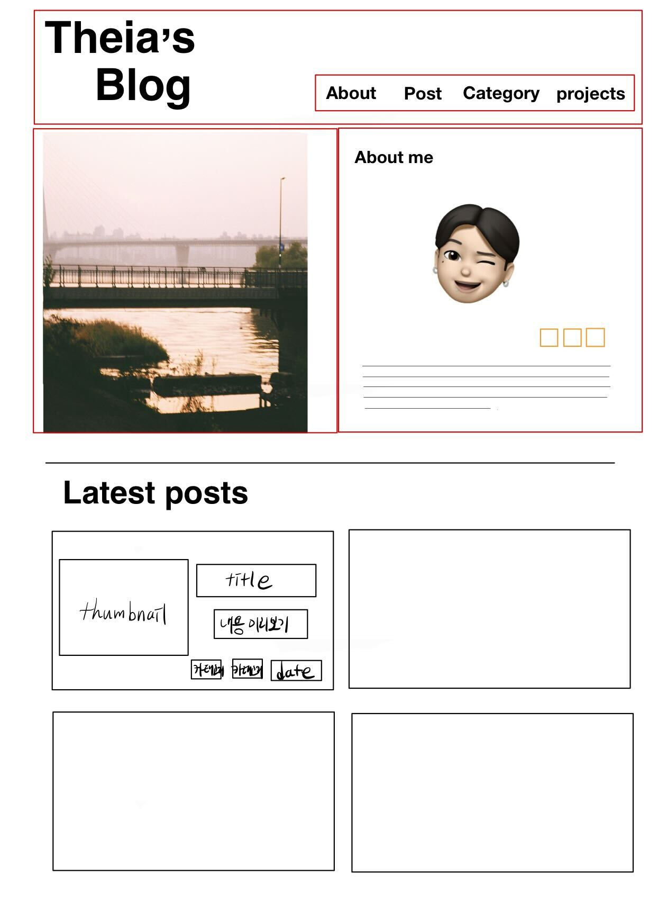

# blog-project

- [설계](#설계)
- [구현](#구현)
- [트러블 슈팅](#트러블-슈팅)

## 설계

### 목표

- `next.js`를 사용하여 `ssg` 블로그 만들기

### 인덱스 페이지

- 로고(헤더)
- 메뉴
- 사진과 짧은 본인 소개 및 블로그 소개
- 최근 포스트

### 메뉴

- about
- post
- category
- projects

#### about

- 메인화면에서 사용한 소개 섹션 재사용
- 블로그 제작에 대한 긴 설명

#### post

- 블로그 게시물

#### category

- 카테고리별 게시물 모아보기

#### projects

- 완성된 프로젝트 게시 예정

### 목표

- `next.js`를 사용해 **블로그** 제작하기

### 사용

| -             | Link                                            |
| :------------ | :---------------------------------------------- |
| Lang          | [typescript](https://www.typescriptlang.org/)   |
| Web Framework | [Next.js](https://nextjs.org/)                  |
| CSS Library   | [Emotion](https://emotion.sh/docs/introduction) |
| CMS           | [MDX](https://github.com/mdx-js/mdx)            |

### 공부 필요

- next.js 사용법
- emotion 사용법
- 반응형 디자인 만드는 법
- seo

### 레이아웃

## 기능

TBD

## 구현

TBD

## 트러블 슈팅

TBD
